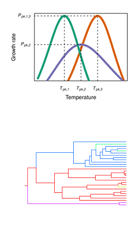
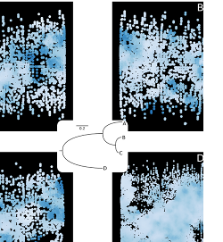
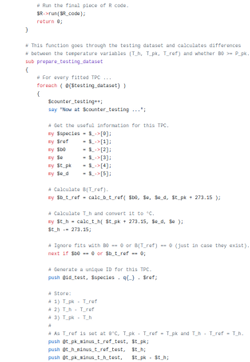

&#10077;<b><i>Nothing in biology makes sense except in the light of evolution.</i></b>&#10078;
 Theodosius Dobzhansky, <i>American Biology Teacher</i>, 1973  

My research interests can be mainly (but not exclusively!) grouped into the three following categories:

<h2><b>Evolutionary thermal biology</b></h2>

Temperature is a major driver of the performance of physiological 
and ecological traits (e.g., growth rate, escape body velocity) of all 
organisms, but especially of ectotherms. It is becoming increasingly clear 
that the shape of the thermal response curve (shown on the right) varies considerably 
across different traits, species, or thermal environments. I am interested 
in identifying processes that generate variation in the shape of the  
response, and factors that constrain it. Understanding 
these should improve our ability to predict the impacts of climate change 
on biological systems.
  

<b>Relevant skills:</b> 
Fitting thermal response curves, phylogeny reconstruction and 
chronogram estimation, phylogenetic comparative methods, 
machine learning, some experience in fitting multivariate mixed-effects models, 
some experience in handling datasets of environmental variables, 
basic experience in mathematical modelling.

  
<b>Relevant publications:</b> 
* <a href='../publication/6_Use_and_misuse_of_temperature' 
style="color:#FF6F6F">Use and misuse of temperature normalisation in 
meta-analyses of thermal responses of biological traits.</a>

 
<h2 style="text-align:right"><b>Evolution of genes and genomes</b></h2>

How do different genes and gene products (co-)evolve during adaptation, 
especially to extreme environments? What can we deduce from the size of 
a gene family across multiple species? Which gene expression alterations 
allow an organism to respond to changes in its local environment? 
These are some of the questions that I am interested in answering using 
comparative genomic and molecular approaches.

  

<b>Relevant skills:</b> 
Gene tree inference, analysis of sequence conservation, 
Gene Ontology term enrichment, homology modelling, 
protein structure comparisons, some experience in performing and analysing molecular 
dynamics simulations, basic experience in identifying coevolving 
protein families, basic experience in gene set enrichment analysis.

  
<b>Relevant publications:</b> 
* <a href='../publication/1_Pinda_A_Web_service_for_detection' 
style="color:#FF6F6F">Pinda: A 
Web service for detection and analysis of intraspecies gene duplication events.</a>

  
<h2><b>Software development for computational biology</b></h2>

The breadth of available datasets (molecular, ecological, 
environmental, or others) continuously expands the range of
questions that we can address to understand the structure and 
functioning of biological systems. To facilitate answering such 
questions, I am particularly interested in 
developing new software tools, or combining pre-existing ones into pipelines. 

  

<b>Relevant skills:</b> 
* Programming experience in <b>Perl 5</b> (extensive), <b>R</b> 
(extensive), <b>Python 2/3</b> (good), <b>Common Lisp</b> (basic), 
<b>C</b> (basic), and <b>Shell</b> (basic). 
* Good experience with <b>SQL</b> databases (SQLite, MySQL). 
* Can work on any major Operating System, including <b>GNU/Linux 
distributions</b> (e.g., Debian, Gentoo) and <b>Mac OS X</b>.

  
<b>Relevant publications:</b> 
* <a href='../publication/4_Structuprint' 
style="color:#FF6F6F">Structuprint: a scalable and extensible tool for 
two-dimensional representation of protein surfaces.</a>
 * <a href='../publication/2_Space_constrained_homology' 
style="color:#FF6F6F">Space Constrained Homology Modelling: The 
Paradigm of the RNA-Dependent RNA Polymerase of Dengue (Type II) Virus.</a>
 * <a href='../publication/1_Pinda_A_Web_service_for_detection' 
style="color:#FF6F6F">Pinda: A 
Web service for detection and analysis of intraspecies gene duplication events.</a>

