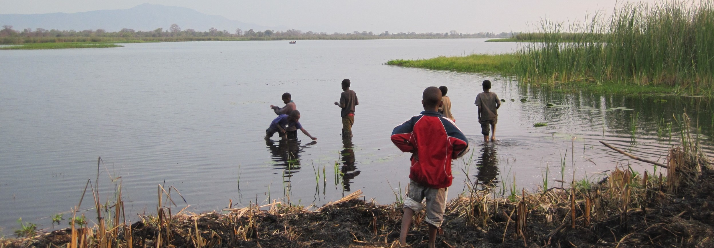

I study how people work together to solve environmental problems. Research interests include climate change adaptation in East Africa; wildfire risk mitigation in the Eastern Cascades; behavioral adaptation to environmental change; brokerage in environmental policy networks; and coupled social and ecological networks. <a href='https://www.dropbox.com/s/aovm8pqlzpefymo/Matthew%20Hamilton%20CV.pdf?dl=0'>CV</a>

Recent projects:

# Mental models of wildfire risk

Wildfires burn large areas of forestland each year throughout Oregon’s Eastern Cascades, threatening human health and safety, local economies, and numerous ecosystem services. Because wildfire can spread across property boundaries and generate other effects at the region-level, responses require collective action: coordination to exchange information necessary for developing responses to increasingly hazardous conditions as well as cooperation to implement risk mitigation activities across multiple private properties or administrative jurisdictions. This project explores how diverse groups of people (forest owners, representatives of environmental groups, ranchers, fire department chiefs, members of the timber industry, representatives of federal and state agencies) conceptualize wildfire risk. The project is also mapping relationships among these groups of people to improve understanding of how patterns of social interaction relate to cognition of wildfire risk. 

---

# Policy networks and climate change adaptation in the Lake Victoria region

The project seeks to improve understanding of the role of institutions in developing adaptive capacity to the near-term effects of climate change in the Lake Victoria region of East Africa. Key adaptive capacity issues in the Lake Victoria region include disruptions to agricultural productivity, altered flood regimes, threats to the viability of fisheries, and shifts in plant and animal habitat suitability. Within the past few decades, numerous collaborative institutions have emerged to help address these adaptive capacity issues. This study explores factors that contribute to the structure of inter-organizational networks and policy networks, as well as how those networks function to improve adaptive capacity in the Lake Victoria region.

