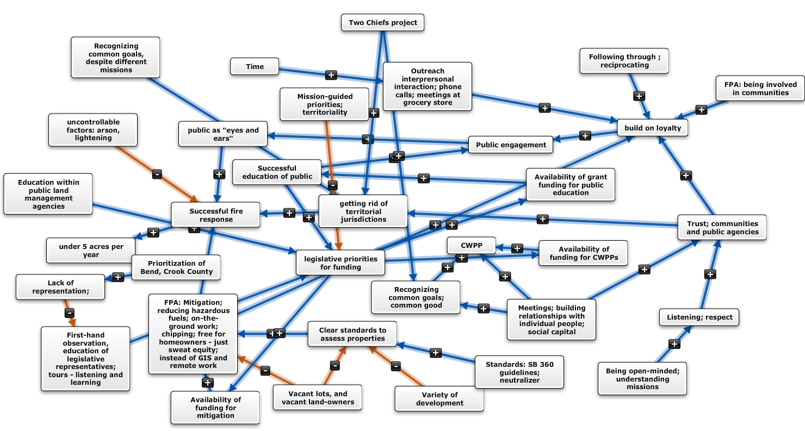

Climate change adaptation in East Africa; Wildfire risk mitigation in the Eastern Cascades; Behavioral adaptation to environmental change; Brokerage in environmental policy networks; Coupled social and ecological networks. I study how people work together to solve environmental problems. <a href='https://www.dropbox.com/s/aovm8pqlzpefymo/Matthew%20Hamilton%20CV.pdf?dl=0'>CV</a>

Recent projects

## Mental models of wildfire risk

Wildfires burn large areas of forestland each year throughout Oregon’s Eastern Cascades, threatening human health and safety, local economies, and numerous ecosystem services. 
Because wildfire can spread across property boundaries and generate other effects at the region-level, responses require collective action: coordination to exchange information necessary for developing responses to increasingly hazardous conditions as well as cooperation to implement risk mitigation activities across multiple private properties or administrative jurisdictions. 
This project explores how diverse groups of people (forest owners, representatives of environmental groups, ranchers, fire department chiefs, members of the timber industry, representatives of federal and state agencies) conceptualize wildfire risk. 
The project is also mapping relationships among these groups of people to improve understanding of how patterns of social interaction relate to cognition of wildfire risk. 

