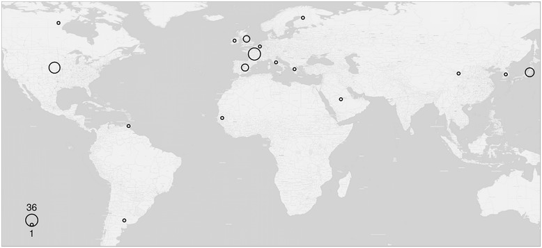

 

### Abstract:

<b>Introduction</b> 
Kawasaki disease is an acute necrotising vasculitis of the medium- and 
small-sized vessels, occurring mainly in Japanese and Korean babies and 
children, aged 6 months to 5 years. Its main complication is damage of 
coronary arteries, which has the potential to be fatal. Here we report a 
rare case of Kawasaki disease that occurred in a 20-year-old Greek adult.  

<b>Case presentation</b> 
A 20-year-old Greek man presented with high fever, appetite loss, nausea 
and vomiting, headache and significant malaise. He had an erythema of 
the palms and strikingly red lips and conjunctiva. As he did not respond 
to broad-spectrum antibiotics and after having excluded other possible 
diagnoses, the diagnosis of Kawasaki disease was set. He was treated with 
intravenous immunoglobulin and oral aspirin on the 10th day since the 
onset of the illness. His clinico-laboratory response was excellent and 
no coronary artery aneurysms were detected in coronary artery computed 
tomography performed 1 month later.  

<b>Conclusions</b> 
This report of an adult case of European Kawasaki disease may be of benefit to physicians of various specialties, including primary care doctors, hospital internists, intensivists and cardiologists. It demonstrates that a case of prolonged fever, unresponsive to antibiotics, in the absence of other diagnoses may be an incident of Kawasaki disease. It is worth stressing that such a diagnosis should be considered, even if the patient is adult and not of Asian lineage.

[Full text](https://jmedicalcasereports.biomedcentral.com/articles/10.1186/s13256-015-0516-9)
\| [Dataset](https://figshare.com/articles/Clinico_laboratory_values_of_an_adult_patient_with_Kawasaki_disease_in_Europe/1080767)
\| [citation](../bibtex/3_Kawasaki.bib)

