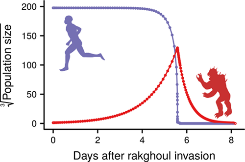

 

### Abstract:

A long time ago in a galaxy far, far away, the Sith Lord Karness Muur 
engineered the rakghoul plague, a disease that transformed infected 
humans into near-mindless predatory rakghouls. At its peak, the disease 
infected millions of individuals, giving rise to armies of rakghouls on 
a number of planets. Whether rakghoul populations have persisted until 
this day is not known, making a rakghoul invasion on Earth not 
completely improbable. Further, a strategy for defence against an 
outbreak of the disease on Earth has not yet been proposed. To fill 
this glaring gap, we developed the first mathematical model of the 
population dynamics of humans and rakghouls during a rakghoul plague 
outbreak. Using New South Wales as a model site, we then obtained 
ensembles of model predictions for the outcome of the rakghoul plague 
in two different disease control strategy scenarios (population 
evacuation and military intervention), and in the absence thereof. 
Finally, based on these predictions, we propose a set of policy 
guidelines for successfully controlling and eliminating outbreaks of 
the rakghoul plague in Australian states.

[Full text](https://doi.org/10.5694/mja17.00792)
\| [citation](../bibtex/5_Towards_a_theoretically_informed.bib)
