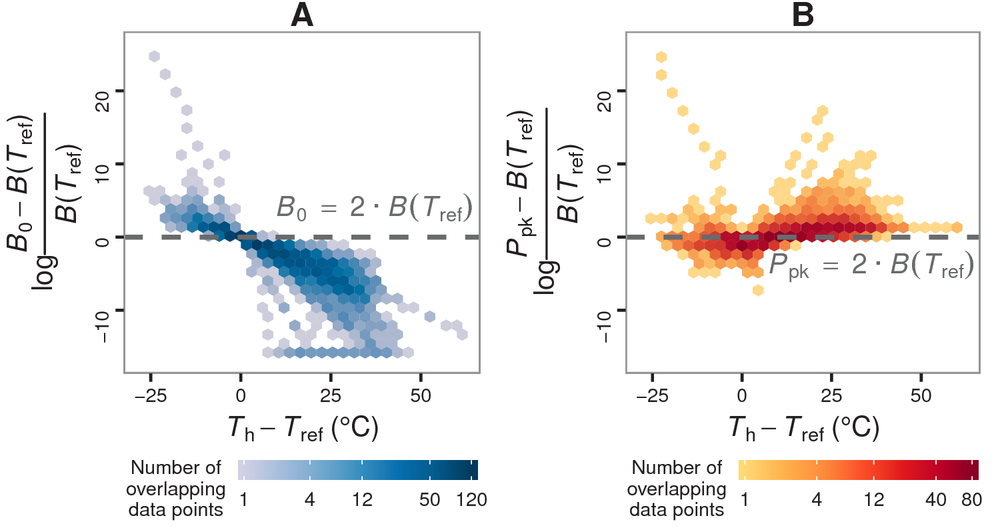

 

### Abstract:

There is currently unprecedented interest in quantifying variation in 
thermal physiology among organisms, especially in order to understand 
and predict the biological impacts of climate change. A key parameter 
in this quantification of thermal physiology is the performance or 
value of a rate, across individuals or species, at a common temperature 
(temperature normalisation). An increasingly popular model for fitting 
thermal performance curves to data—the Sharpe-Schoolfield equation—can 
yield strongly inflated estimates of temperature-normalised rate values. 
These deviations occur whenever a key thermodynamic assumption of the 
model is violated, i.e., when the enzyme governing the performance of 
the rate is not fully functional at the chosen reference temperature. 
Using data on 1,758 thermal performance curves across a wide range of 
species, we identify the conditions that exacerbate this inflation. We 
then demonstrate that these biases can compromise tests to detect 
metabolic cold adaptation, which requires comparison of fitness or rate 
performance of different species or genotypes at some fixed low 
temperature. Finally, we suggest alternative methods for obtaining 
unbiased estimates of temperature-normalised rate values for 
meta-analyses of thermal performance across species in climate change 
impact studies.

[Full text](https://peerj.com/articles/4363/)
\| [Source code](https://github.com/dgkontopoulos/Kontopoulos_et_al_temperature_normalisation_2017)
\| [citation](../bibtex/6_Use_and_misuse_of_temperature.bib)
